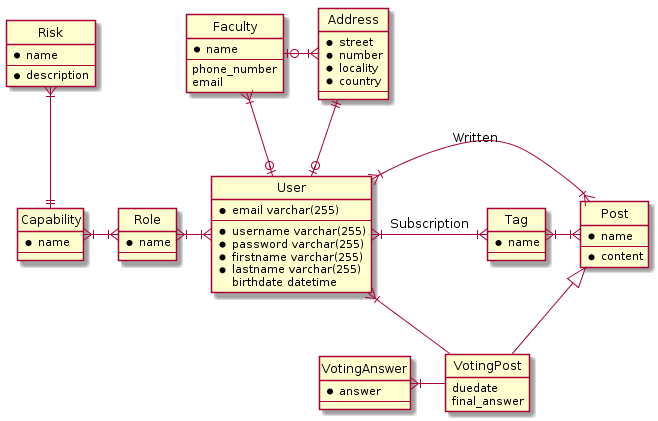

# infom114_LaboMDL

## Quickstart

1. install rust(cargo)
2. go nighty
3. setup mariadb on your machine (look at logins in .env & rocket.toml)
4. Install `diesel-cli`
5. `diesel migration run`
6. `cargo build` && `cargo run`
7. go on localhost:8000

## Dockerization

1. Install docker and docker-compose
2. docker-compose up [--build]
3. go on <http://localhost:8000/hello/yourname>

## Features

- Utilisateurs: Profs, etudiants, AGEs, Cercles,
- Cana
- Categories des contenu
- Types de contenu:
  - Informatif (Event)
  - Decisionnel (Poll)
  - Questions (Comme StackOverflow? :D)
  - Boite a idee

## DB

