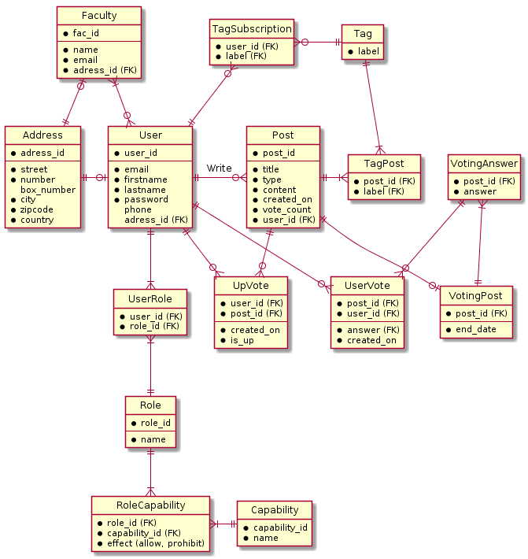

## Features

- Utilisateurs: Profs, etudiants, AGEs, Cercles,
- Cana
- Categories des contenu
- Types de contenu:
  - Informatif (Event)
  - Decisionnel (Poll)
  - Questions (Comme StackOverflow? :D)
  - Boite a idee

## DB

